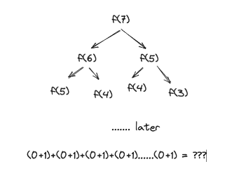

# Template TypeScript
## Diseño Sostenible - Ingeniería y Artesanía del Software con TypeScript

Plantilla base para practicar las katas del curso o para empezar un proyecto nuevo.

Incluye:
* TypeScript
* Jest
* ESLint
* Prettier
* Husky

## Instrucciones
* `nvm use`
* `npm install`
* `npm test`

Más información sobre el curso en [diseñosostenible.com](https://diseñosostenible.com).

### ESLint
[TypeScript ESLint Rules](https://github.com/typescript-eslint/typescript-eslint/tree/master/packages/eslint-plugin)

### Husky hooks
* Pre-commit: Execute npm analize (tsc + eslint --fix)
* Pre-push: Execute test

## Requisitos de la kata

Vamos a construir una funcion que reciba como parámetro un número entero y devuelva el enésimo número de Fibonacci. 
En matemáticas, la serie de Fibonacci es la sucesión infinita de números naturales tales como los siguientes:

* 0,1,1,2,3,5,8,13,21,34,55,89,144,233,377,610,987,1597

La sucesión comienza con 0 y 1, los siguientes térmninos siempre son la suma de los dos anteriores.

Por tanto, el parámetro que entra en la función es la posición del número 

Lo que está pasando aqui es que si le pasas el numero 359000 la función se va a ejecutar miles y miles de veces hasta 
que llegue a los casos en los que el parametro es cero o uno date cuenta que cuando indicas un numero grande va a ir 
entrando en la función y como no puede ejecutar nada normal va a llamarse a si misma pero con los parámetros cada vez menores.
En cada iteracción date cuenta que las combinacoines se van agrandando y por tanto al final tendrás un montón de funciones 
que si se pueden ejecutar y que los parametros de entrada  solo serán 0 y 1, pero todos ellos sumados darán como resultado inveitablemente el resultado de fibonacci.

